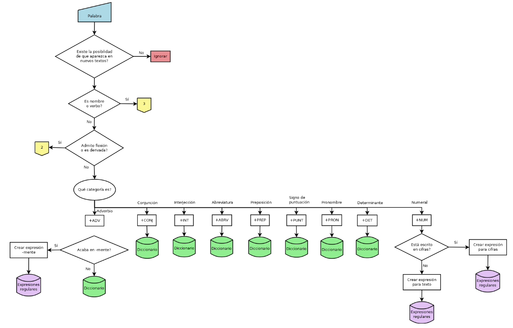
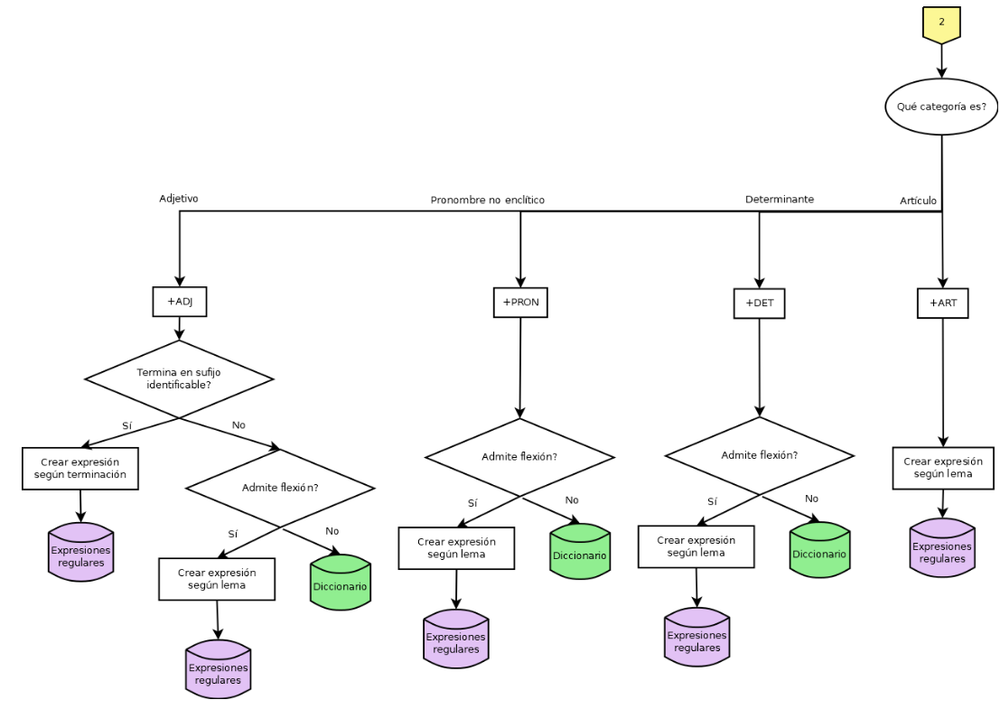

# Regular Expression–Based Morphological Analyzer

This project implements a **basic rule-based morphological analyzer for Spanish** using a combination of:

- **regular expressions**
- **dictionary-based tagging**
- **NLTK tokenization**

The analyzer processes a text and assigns **morphological tags** to each token according to a set of handcrafted linguistic rules.

---

## Project Objective

The goal of the project is to explore the design of a **rule-based morphological analyzer** for Spanish by **combining linguistic knowledge with domain-specific vocabulary** extracted from a manually analyzed training text.

The system is designed to balance two competing objectives:

- **Effectiveness**: correctly tagging the training text used during development.
- **Generality**: processing new texts from the same domain with acceptable accuracy.

Rather than aiming to build a fully general morphological analyzer, the project focuses on a **domain-specific setting**, where handcrafted rules and lexical resources can provide strong results with limited data.

---

## Linguistic Analysis

The regular expressions and dictionary entries were designed after manually analyzing a **training text** from the computer science domain. To support this analysis, we used **FreeLing**, an NLP tool developed by [Padró (2012)](https://nlp.lsi.upc.edu/publications/papers/padro12.pdf), which provides morphological tagging and probabilities for each possible tag. 

For each tagged word in the training corpus, we evaluated whether it was preferable to:

- create a **regular expression** capturing a general morphological pattern, or  
- include the word directly in the **dictionary**

Regular expressions were designed to be **as general as possible**, covering not only the words appearing in the training text but also similar forms that may appear in new texts.

The following diagrams summarize the decision process used when designing the tagging rules.




Further details about the linguistic criteria used in the design process can be found in [*Procedimiento y discusión.pdf*](./Procedimiento%20y%20discusi%C3%B3n.pdf), including:

- criteria for creating regular expressions
- treatment of morphological ambiguity
- corpus expansion strategies
- prioritization of rules

---

## Technical Approach

The analyzer follows a **two-stage tagging strategy**.

### 1. Rule-based tagging

A set of regular expressions identifies grammatical categories based on morphological patterns such as suffixes and inflectional endings.

These rules cover, among others:

- determiners
- pronouns
- numerals
- adjectives
- verbs
- nouns

### 2. Dictionary override

A manually built dictionary contains:

- prepositions
- conjunctions
- pronouns
- punctuation symbols
- common adverbs
- frequent domain-specific words, including anglicisms

If a token appears in the dictionary, its tag **overrides** the one assigned by the regular-expression tagger.

This hybrid approach combines the **precision of lexical lookup** with the **generalization power of morphological rules**.

---

## Tagset

The project uses a simplified tagset including:

| Category | Tag |
|----------|-----|
| Adverb | ADV |
| Article | ART |
| Adjective | ADJ |
| Determiner | DET |
| Pronoun | PRON |
| Conjunction | CONJ |
| Numeral | NUM |
| Abbreviation | ABRV |
| Preposition | PREP |
| Punctuation | PUNT |

For nouns and verbs, the tags follow the **EAGLES morphosyntactic annotation scheme**, encoding additional features such as:

- gender
- number
- tense
- person

Example:

```NCFS```  

means:

**Noun – Common – Feminine – Singular**

---

## Repository Structure

```
Analizador morfológico/
│
├── Programa.py
├── texto.txt
├── Procedimiento y discusión.pdf
├── Analysis.xlsx
├── imagenes/
└── README.md
```

**Programa.py**  
Implementation of the morphological analyzer.

**texto.txt**  
Training text containing descriptions of computer science concepts.

**Analysis.xlsx**  
POS-tag analysis of training text provided by Freeling

**Procedimiento y discusión.pdf**  
Report describing the methodology and evaluation of the analyzer.

**Procedimiento y discusión.pdf**  
Report describing the methodology and evaluation of the analyzer.

**imagenes/**  
Diagrams illustrating the rule design process.


---

## Evaluation

The analyzer was evaluated by comparing its output against the manual analysis of a test text.

Despite being trained on a relatively small corpus (661 tokens), the system achieved an **accuracy of approximately 90%** in assigning the correct morphological tags.

Most errors were caused by limitations inherent to the rule-based approach, particularly:

- **Singular nouns ending in *-s*** being incorrectly tagged as plurals.
- **Masculine nouns ending in *-a*** being incorrectly tagged as feminine  
  (e.g., *inglés*, *problema*).

These errors arise because the system relies primarily on **surface morphological patterns**, without contextual disambiguation or deeper lexical knowledge.

Nevertheless, the results show that combining **regular expressions with a dictionary of domain-specific vocabulary** provides an effective approach within a restricted domain.

The evaluation also suggests that performance could be further improved by:

- adding more **regular expressions for additional morphological patterns**
- expanding the **dictionary with more domain-specific vocabulary**
- training on **larger corpora**.